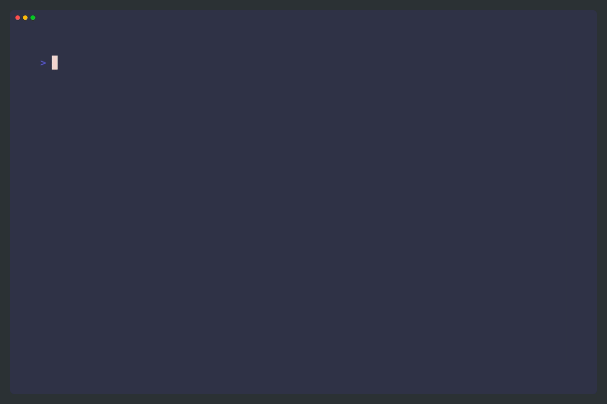

# Echo

A CLI tool to convert your existing **VSCode themes** to **iTerm colors**.

## Demo



## Installation

```bash
go install github.com/jeromeandrewong/echo-vsc/cmd/echo-vsc@latest
```

## Usage

```bash
echo-vsc
```

## Project Structure

```txt
echo-vsc/
├── cmd/
│   └── echo-vsc/
│       └── main.go
├── internal/
│   ├── constants/
│   │   └── constants.go
│   ├── logger/
│   │   └── logger.go
│   ├── theme/
│   │   └── theme.go
│   ├── vsc/
│   │   └── vsc.go
│   └── converter/
│       └── converter.go
├── pkg/
│   └── utils/
│       └── utils.go
└── go.mod
└── go.sum
└── README.MD
```

## How it works

1. When user starts the program, we get all of the user's VSCode themes from the `~/.vscode/extensions` folder.
2. We start a goroutine for each extension folder, which processes an extension (by reading and unmarshalling file) and sends its themes through a channel.
3. The main goroutine collects themes from the theme channel and appends them to the `allThemes` slice.
4. we display the themes to the user in a list from [bubbletea's library](https://github.com/charmbracelet/bubbletea), just for aesthetic purposes (`vsctheme_picker.go`)
5. If the user-selected theme does not have a `themeType` set, we ask the user to select one either `light` or `dark`. (`theme_type_picker.go`)
6. After getting the file path of the selected theme, we convert it to an iTerm theme using the `convertTheme` function (`converter.go`)
    - read theme file
    - removes comments and trailing commas or unmarshalling errors will occur
    - unmarshal the cleaned file
    - iterate through ANSI color mappings and retrive corresponding color from vscode theme + add fallback colors if missing
    - convert hex color to RGBA (iterm uses RGBA)
    - generate iTerm theme XML
